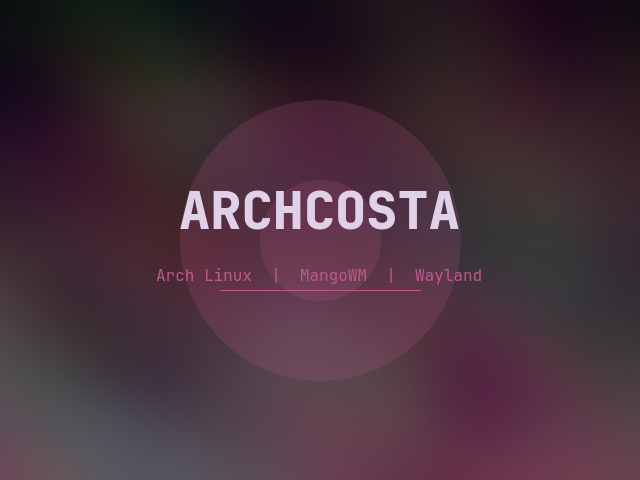

<p align="center">
  
</p>

<h1 align="center">ArchCosta</h1>

<p align="center">
  <strong>Minimal Arch Linux + MangoWM Wayland</strong><br>
  <sub>Personal project. Use it if you want.</sub>
</p>

<p align="center">
  
  
  
</p>

---

A lightweight Arch Linux live ISO with MangoWM, Waybar, Rofi, Foot, and a custom dark purple palette. Built on [archiso](https://wiki.archlinux.org/title/Archiso).

## Build

```bash
git clone https://github.com/archcosta-os/archcosta.git
cd archcosta
sudo ./build -v .
```

Output goes to `out/`. Needs an Arch system with `archiso` installed.

## Keybindings

| Key | Action |
|-----|--------|
| `Super+Return` | Terminal |
| `Super+Space` | Launcher |
| `Super+w` | Firefox |
| `Super+q` | Close |
| `Super+f` | Fullscreen |
| `Super+s` | Float toggle |
| `Super+1-9` | Switch tag |
| `Super+Shift+e` | Power menu |
| `Super+l` | Lock |

Full list in `Documents/Keybindings`.

## Customization

- **Wallpaper**: Edit `~/.config/mango/config.conf` (`exec-once=swaybg -i ...`)
- **Packages**: Edit `packages.x86_64`
- **Colors**: `~/.config/{mango,waybar,rofi,foot,mako}/`

5 wallpapers included in `Backgrounds/`.

## License

GPL-3.0
